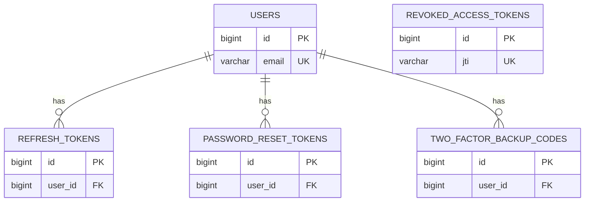
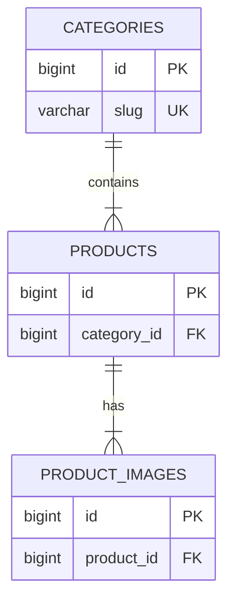
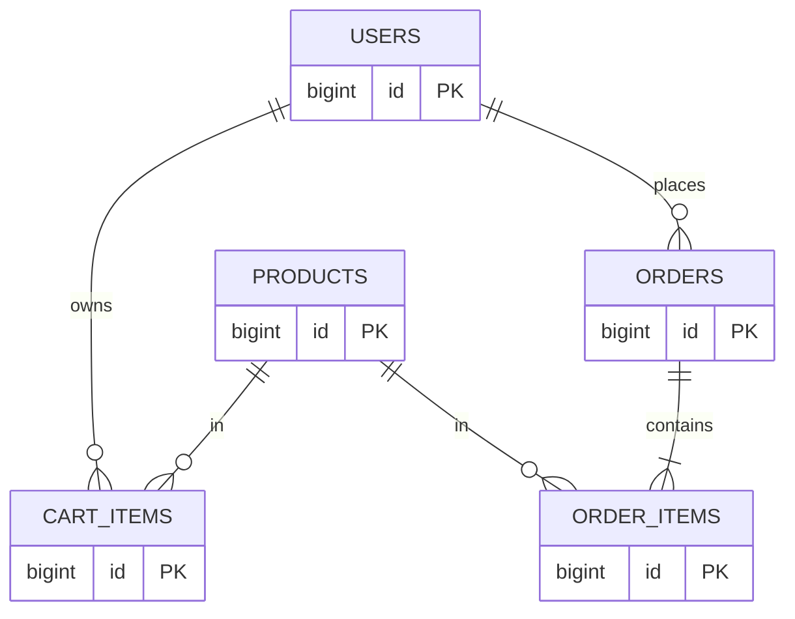

# ESTValgus

B2C lighting shop built for a coursework/viva project. Customers browse a product catalog, filter and sort results, and use a client-side cart. Accounts support email/password login, Google OAuth, optional 2FA, and password reset.

**Stack:** React (Vite) + Spring Boot + PostgreSQL, packaged with Docker Compose.

---

## What is implemented

| Area | Status |
|------|--------|
| B2C storefront (browse, search, cart) | Done |
| Email/password auth | Done |
| Google OAuth | Done (needs Google Client ID in `.env`) |
| reCAPTCHA v3 on registration | Done (skipped if keys are empty) |
| JWT access token in memory + httpOnly refresh cookie | Done |
| Refresh token rotation (single-use) | Done |
| Access + refresh revocation on logout | Done |
| Password reset flow | Done (real email only if SMTP is configured) |
| TOTP 2FA (QR, backup codes) | Done |
| Product API: search, facets, sort, images | Done |
| Automated backend tests | 35 (`mvn test`) |
| Checkout / orders / payments | Not started |


---

## Run with Docker

You only need Docker installed on the host.

```bash
git clone <repo>
cd projects   # repository root
cp example.env .env          # optional: Google OAuth, reCAPTCHA, SMTP
docker compose up --build
```

| Service | URL |
|---------|-----|
| Shop | http://localhost:3000 |
| API | http://localhost:8080/api |
| Database | `localhost:5432`, db `lampify_db`, user/pass `postgres` |

Stop: `docker compose down`  
Reset DB + uploads: `docker compose down -v`

Rebuild after changing `VITE_*` build args: `docker compose up --build`

### Local dev (without full Docker stack)

```bash
cd backend && docker compose up -d postgres
cd backend && mvn spring-boot:run
cd frontend && npm install && npm run dev   # http://localhost:5173
```

The backend loads `GOOGLE_CLIENT_ID` from the root `.env` when you run Maven locally.

---

## Usage

### Register and log in

1. Open the shop (port 3000 or 5173 in dev).
2. **Register** with a strong password (8+ chars, upper, lower, digit, special). reCAPTCHA runs when keys are set.
3. **Log in** — access token stays in a JavaScript variable; refresh token is an httpOnly cookie.
4. **Google login** — configure `VITE_GOOGLE_CLIENT_ID` and `GOOGLE_CLIENT_ID` (see `example.env`).
5. **Forgot password** — triggers reset token; without SMTP the link is printed in the **backend log** (look for `Mail not configured. Password reset link for ...`).
6. **2FA** — Profile → **Two-factor auth** → generate QR → verify with authenticator app. Google accounts skip the password step.

### Catalog

- Search bar (debounced) matches name, description, brand.
- Sidebar: category, brand, price range.
- Sort: relevance, price, rating, name.
- Cart is browser-only (not saved to the server).

### API samples

```bash
curl "http://localhost:8080/api/products?search=bulb&sort=price_asc"
curl http://localhost:8080/api/categories
```

### Tests

```bash
cd backend && mvn test
```

| Test class | Type | What it checks |
|------------|------|----------------|
| `AuthServiceTest` | Unit | Register, login, 2FA, refresh, reset, logout |
| `ProductServiceTest` | Unit | Catalog mapping and search response |
| `RateLimitingFilterTest` | Unit | Auth rate limits |
| `AuthIntegrationTest` | Integration | Full auth flow; **refresh token reuse rejected** |
| `ProductCatalogIntegrationTest` | Integration | Search, filters, pagination, categories |
| `AuthSecurityTest` | Security | XSS/SQL payloads on register, weak password |
| `ProductCatalogSecurityTest` | Security | Injection in search, public catalog access |
| `OAuthEndpointSecurityTest` | Security | OAuth endpoint reachable without prior auth |
| `AuthControllerTest` | API | Controller validation |

Manual walkthroughs: [docs/VIVA_PREP.md](docs/VIVA_PREP.md)  
Testing notes: [TESTING_STRATEGY.md](TESTING_STRATEGY.md)

---

## Architecture 

**Why this shape**

- **Spring Boot** — REST API, security, JPA, Flyway migrations in one place.
- **React + Vite** — product grid, auth forms, filters without full page reloads.
- **PostgreSQL** — relational catalog + auth tables; ACID transactions for token rotation and future checkout.
- **Docker Compose** — postgres, API, and nginx frontend start together for demos.

**JWT**

| Token | Lifetime | Where it lives |
|-------|----------|----------------|
| Access | 15 min | In-memory in `AuthContext.tsx` |
| Refresh | 7 days | httpOnly cookie |

A JWT has three parts:

1. **Header** — algorithm (`HS256`) and type (`JWT`)
2. **Payload** — `sub` (email), `jti` (ID for revocation), `type`, `exp`, `iat`
3. **Signature** — HMAC over `header.payload` with `app.jwt.secret`

Code: `backend/src/main/java/com/lampify/security/JwtUtil.java`

On refresh, the old refresh token is marked `used` and `revoked`; a new one is issued. Reusing the old token fails (`AuthIntegrationTest.refreshTokenRotationRejectsOldToken`). On logout, the access token `jti` goes into `revoked_access_tokens`.

**ACID (why it matters here)**

- **Atomicity** — refresh rotation updates the old row and inserts a new one inside one `@Transactional` method; both commit or neither does.
- **Consistency** — FK constraints (e.g. `products.category_id`) stop orphan rows.
- **Isolation** — concurrent logins get separate refresh rows; future checkout would use `SELECT … FOR UPDATE` on stock.
- **Durability** — committed tokens and catalog data survive a Postgres restart.

**PostgreSQL and growth**

- B-tree indexes on `brand`, `price`, `rating`, `category_id`
- GIN index on `products.search_vector` (maintained by trigger)
- HikariCP pool (10 connections) in `application.properties`
- Read replicas / Redis caching are not set up — reasonable next steps if traffic grows

**Search**

- **Schema:** trigger fills `search_vector` (tsvector) from name (weight A), brand (B), description (C).
- **Runtime:** `ProductRepositoryImpl` uses `ILIKE` on name, description, brand for the `search` query param.
- **Facets:** response includes categories, brands, min/max price for the current filter set.
- **Sort:** `relevance`, `price_asc`, `price_desc`, `rating`, `name`.

Example:  
`GET /api/products?search=bulb&category=smart-bulbs&brand=LuminaTech&minPrice=20&maxPrice=50&sort=price_asc`

---

## Entity-relationship diagram

Below matches **Flyway migrations V1–V7**. Gitea’s Mermaid preview shrinks huge diagrams, so relationships are split into three readable charts; column details are in the tables underneath.

**Cardinality / modality**

| Notation | Meaning |
|----------|-----------|
| `1:N` | One parent, many children |
| `(1,1)` | Exactly one — required FK |
| `(0,N)` | Zero or many — optional side |
| UK | Unique key |

### Auth & security



`REVOKED_ACCESS_TOKENS` is standalone (no FK to `USERS`); rows are keyed by access-token `jti`.

### Catalog



### Planned checkout (not implemented yet)



Cart is **client-side only** today; these tables are shown for planned checkout work.

### Entity columns

**USERS**

| Column | Notes |
|--------|--------|
| `id` | PK |
| `email` | UK, NOT NULL |
| `password` | BCrypt, NOT NULL |
| `username` | NOT NULL |
| `provider` | nullable — OAuth provider |
| `enabled` | default true |
| `two_factor_enabled` | default false |
| `two_factor_secret` | nullable |
| `last_login_at` | nullable |
| `failed_login_attempts` | |
| `account_locked_until` | nullable |
| `created_at`, `updated_at` | |

**REFRESH_TOKENS** — `user_id` FK, `token` UK, `expires_at`, `revoked`, `used`, `created_at`

**PASSWORD_RESET_TOKENS** — `user_id` FK, `token` UK, `expires_at`, `used`, `created_at`

**REVOKED_ACCESS_TOKENS** — `jti` UK, `expires_at`, `revoked_at`

**TWO_FACTOR_BACKUP_CODES** — `user_id` FK, `code_hash`, `used`, `created_at`

**CATEGORIES** — `name`, `slug` UK, `description`, `created_at`

**PRODUCTS** — `category_id` FK, `name`, `description`, `price`, `stock_quantity`, `brand`, `rating`, dimensions/weight fields, `search_vector`, timestamps

**PRODUCT_IMAGES** — `product_id` FK, `file_name`, `url_path`, `is_primary`, `sort_order`, `created_at`

**CART_ITEMS / ORDERS / ORDER_ITEMS** — planned; see migrations when checkout is added

**Relationship summary**

| From | To | Cardinality | Modality |
|------|-----|-------------|----------|
| User | Refresh tokens | 1:N | User must exist; many tokens over time (rotation) |
| User | Password reset tokens | 1:N | Optional until reset requested |
| User | 2FA backup codes | 1:N | Only when 2FA setup runs |
| Category | Products | 1:N | Each product belongs to exactly one category |
| Product | Product images | 1:N | At least zero images; UI uses placeholder if none |
| User | Cart / Orders | 1:N | Planned — cart is client-side today |

---


## Other docs

| File | Purpose |
|------|---------|
| [example.env](example.env) | OAuth, reCAPTCHA, SMTP template |
| [docs/RECAPTCHA_SETUP.md](docs/RECAPTCHA_SETUP.md) | reCAPTCHA keys, localhost, and Render |
