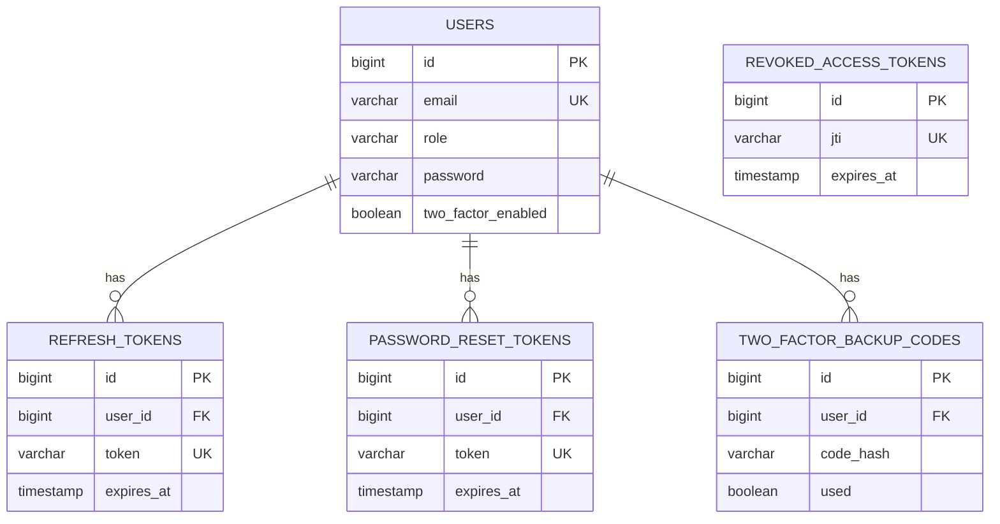

# ESTValgus

B2C lighting shop with a server-backed shopping cart, checkout, sandbox payments (Stripe / CARD / PayPal simulation), and order management. Also includes account features (email login, Google OAuth, 2FA, password reset).

**Stack:** React (Vite) + Spring Boot + PostgreSQL + RabbitMQ, run with Docker Compose.

---

## Setup

**Prerequisites:** Docker (and Docker Compose). Optional: Stripe CLI for webhook testing.

```bash
git clone <repo>
cd projects
cp example.env .env    # optional: OAuth, SMTP, Stripe keys
docker compose up --build
```

| Service | URL |
|---------|-----|
| Shop | http://localhost:3000 |
| API | http://localhost:8080/api |
| RabbitMQ UI | http://localhost:15672 (`guest` / `guest`) |

### HTTPS (self-signed TLS)

Host still only needs Docker. Generate a local certificate, then start the TLS overlay (shop on **https://localhost:3000**):

```bash
./testing/scripts/generate-tls.sh
docker compose -f docker-compose.yml -f docker-compose.tls.yml up --build
```

The browser will warn about the self-signed cert — proceed once for `localhost`. Refresh cookies are marked `Secure` in this profile. HTTP `docker compose up` remains the default for local HTTP demos.

Stop: `docker compose down` · Reset data: `docker compose down -v`

**Local dev:** run Postgres (or full compose stack), then `cd backend && mvn spring-boot:run` and `cd frontend && npm install && npm run dev` (http://localhost:5173). See [example.env](example.env) for variables.

---

## Usage

### Shopping cart

- Open the cart from the shop header. Each line shows **name, price, thumbnail**, quantity controls, and line subtotal.
- **Guests:** cart stored in PostgreSQL, keyed by httpOnly `guestCartToken` cookie.
- **Logged-in users:** persistent user cart; guest cart **merges on login**.
- **Recommendations:** “You may also like” suggestions based on cart categories.
- Out-of-stock adds/updates return clear API errors (no silent failures).

### Checkout

Single route `/checkout`:

1. Contact, **shipping method** (active delivery options), shipping address, payment method (STRIPE / CARD / PAYPAL sandbox).
2. Merchandise total stays excl. shipping; shipping is a separate line. Place order → pay on the same page (no redirect on failure; errors shown inline).
3. Success → confirmation view with **estimated delivery** from the chosen option; **confirmation email sent after payment succeeds**.

Logged-in users get **email and name prefilled**. Address and payment fields are validated on the client and server.

**Sandbox test cards** (CARD mode): `4242…` success, `4000…9995` insufficient funds, `4000…0002` invalid, `4000…0069` expired, `4000…0010` timeout. PayPal sandbox uses approve/decline buttons (no card form).

### Orders & payments

- **Orders** (`/orders`): filter by status, sort by date; detail page with status history.
- **Cancel** unprocessed orders (`PENDING_PAYMENT`) — stock is restored.
- **Payments:** Stripe Elements when keys are set; otherwise local sandbox. Card data never stored on the server.
- **RabbitMQ:** payment events published to a queue; consumer sends failure notification emails (`APP_MESSAGING_ENABLED`).
- **Inventory:** stock reserved at place-order (`SELECT … FOR UPDATE`); restored on payment failure or cancel; re-reserved on retry.

### Auth (summary)

Register / login, Google OAuth, forgot password, optional 2FA under Profile. JWT access token in memory; refresh token in httpOnly cookie. **Admin accounts must enable TOTP 2FA** before `/admin` works.

### Admin

Seed user (Compose / `example.env`): `admin@estvalgus.local` / `Admin123!`. First login redirects to **Profile → Security** until 2FA is on.

| Route | What |
|-------|------|
| `/admin` | Dashboard counts |
| `/admin/products` | CRUD, image upload (thumb/medium/full), bulk **CSV or JSON** |
| `/admin/categories` | Taxonomy CRUD |
| `/admin/delivery` | Delivery-option CRUD (delete deactivates if used on an order) |
| `/admin/orders` | Status, assign shipping, refunds |
| `/admin/users` | Role + enabled |
| `/admin/reviews` | Approve / reject pending reviews |

### Reviews

Purchase-verified only (`PAID` / `SHIPPED` / `FULFILLED` order containing the product). Submit stays **PENDING** until an admin approves; then it appears on the product with rating average. Signed-in users can **Mark helpful**; default sort is most helpful.

---

## Tests

```bash
cd backend && mvn test
```

| Test class | Type | What it checks |
|------------|------|----------------|
| `CartServiceTest` | Unit | Cart totals, stock limits, remove item |
| `OrderServiceTest` | Unit | Checkout validation, order totals, cancel restock |
| `CheckoutFlowIntegrationTest` | Integration | Register, cart, checkout, pay, **payment fail → retry → success**, cancel |
| `AuthIntegrationTest` | Integration | Auth flow, refresh token rotation |
| `ProductCatalogIntegrationTest` | Integration | Search, filters, categories |
| `AuthServiceTest` | Unit | Register, login, 2FA, reset |
| `ProductServiceTest` | Unit | Catalog mapping |
| `AuthSecurityTest` | Security | Injection / weak password on register |
| `ProductCatalogSecurityTest` | Security | Search injection |
| `OAuthEndpointSecurityTest` | Security | OAuth endpoints |
| `RateLimitingFilterTest` | Unit | Token-bucket auth burst / 429 |
| `TokenBucketRateLimitTest` | Unit | Refill + shared auth bucket |
| `EncryptionAtRestTest` | Security | Order PII, 2FA secret, hashed refresh tokens |
| `ReviewIntegrationTest` | Integration | Submit → pending hidden → admin approve → visible; helpful-vote sort |
| `BulkUploadIntegrationTest` | Integration | CSV + JSON bulk; featured flag; invalid rows skipped |
| `AdminDeliveryOptionsTest` | Integration | Delivery CRUD + 403 without admin/2FA |
| `AdminSecurityTest` | Security | Admin RBAC + 2FA gate |
| `FileStorageServiceTest` | Unit | Thumb / medium / full image variants |
| `AuthControllerTest` | API | Controller validation |

Load tests (k6, against a running stack): [testing/k6](testing/k6) · [testing/README.md](testing/README.md) · report [testing/reports/load-test-2026-08-26.md](testing/reports/load-test-2026-08-26.md).

```bash
./testing/scripts/run-load-tests.sh smoke   # API must be up
./testing/scripts/run-load-tests.sh full
```

---

## Performance

**SLA used in scripts:** p95 latency ≤ 5 seconds.

| Scenario | Script | What it does |
|----------|--------|----------------|
| S1 Browse | `testing/k6/browse.js` | Weighted GET `/home`, `/products`, `/products/{id}`, `/products/suggest` |
| S2 Checkout | `testing/k6/checkout.js` | Guest cart → `POST /orders` (with shipping) → sandbox pay |

Measured p95 / VU numbers go in [testing/reports/load-test-2026-08-26.md](testing/reports/load-test-2026-08-26.md) after a k6 run. That file also lists bottlenecks already addressed:

- Hikari pool **25** (was 10)
- Hibernate SQL logging **off** for Compose (was DEBUG/TRACE)
- **V21** `pg_trgm` indexes for `LOWER(name|brand) LIKE` search
- Listing/cart use **thumbnail** image variants

---

## Architecture (commerce flow)

```
Customer → Cart API (guest cookie / user cart)
         → POST /orders (PENDING_PAYMENT, stock reserved)
         → Payment API (Stripe Elements or sandbox)
         → Order PAID or FAILED (stock adjusted)
         → RabbitMQ event → failure email (async)
         → Confirmation email on success (sync)
```

Order PII and payment failure messages are **encrypted at rest** (AES-GCM, `APP_ENCRYPTION_SECRET`).

---

## Entity-relationship diagram

Flyway migrations **V1–V21**. Guest carts use `guest_token`; logged-in carts use `user_id` (mutually exclusive). Order contact fields, order item names, and 2FA secrets are encrypted at rest; refresh tokens are stored as SHA-256 hashes.

### Commerce

```mermaid
erDiagram
    USERS ||--o| CARTS : owns
    CARTS ||--|{ CART_ITEMS : contains
    PRODUCTS ||--o{ CART_ITEMS : in
    USERS ||--o{ ORDERS : places
    ORDERS ||--|{ ORDER_ITEMS : contains
    PRODUCTS ||--o{ ORDER_ITEMS : in
    ORDERS ||--|{ ORDER_STATUS_HISTORY : tracks
    ORDERS ||--|{ PAYMENT_TRANSACTIONS : paid_by
    ORDERS ||--o{ REFUNDS : refunded_by
    DELIVERY_OPTIONS ||--o{ ORDERS : ships
    CATEGORIES ||--|{ PRODUCTS : contains
    PRODUCTS ||--|{ PRODUCT_IMAGES : has
    PRODUCTS ||--o{ REVIEWS : reviewed_in
    USERS ||--o{ REVIEWS : writes
    ORDERS ||--o{ REVIEWS : verifies
    REVIEWS ||--o{ REVIEW_HELPFUL_VOTES : voted_on
    USERS ||--o{ REVIEW_HELPFUL_VOTES : casts

    USERS {
        bigint id PK
        varchar email UK
        varchar role
        boolean two_factor_enabled
    }
    CARTS {
        bigint id PK
        bigint user_id FK UK
        varchar guest_token UK
    }
    CART_ITEMS {
        bigint id PK
        bigint cart_id FK
        bigint product_id FK
        int quantity
    }
    CATEGORIES {
        bigint id PK
        varchar slug UK
        varchar name
    }
    PRODUCTS {
        bigint id PK
        bigint category_id FK
        varchar name
        decimal price
        int stock_quantity
        boolean featured
        boolean active
        int review_count
    }
    PRODUCT_IMAGES {
        bigint id PK
        bigint product_id FK
        varchar url_path
        varchar thumb_path
        varchar medium_path
        boolean is_primary
    }
    DELIVERY_OPTIONS {
        bigint id PK
        varchar name
        decimal price
        int estimated_days
        boolean active
    }
    ORDERS {
        bigint id PK
        varchar order_number UK
        bigint user_id FK
        bigint delivery_option_id FK
        varchar status
        varchar payment_method
        decimal total_amount
    }
    ORDER_ITEMS {
        bigint id PK
        bigint order_id FK
        bigint product_id FK
        varchar product_name
        int quantity
        decimal line_total
    }
    ORDER_STATUS_HISTORY {
        bigint id PK
        bigint order_id FK
        varchar status
        varchar note
    }
    PAYMENT_TRANSACTIONS {
        bigint id PK
        bigint order_id FK
        varchar provider
        varchar status
        decimal amount
    }
    REFUNDS {
        bigint id PK
        bigint order_id FK
        decimal amount
        varchar status
    }
    REVIEWS {
        bigint id PK
        bigint product_id FK
        bigint user_id FK
        bigint order_id FK
        int rating
        varchar status
    }
    REVIEW_HELPFUL_VOTES {
        bigint id PK
        bigint review_id FK
        bigint user_id FK
    }
```

### Auth (supporting tables)


```mermaid
erDiagram
    USERS ||--o{ REFRESH_TOKENS : has
    USERS ||--o{ PASSWORD_RESET_TOKENS : has
    USERS ||--o{ TWO_FACTOR_BACKUP_CODES : has

    USERS {
        bigint id PK
        varchar email UK
        varchar role
        varchar password
        boolean two_factor_enabled
    }
    REFRESH_TOKENS {
        bigint id PK
        bigint user_id FK
        varchar token UK
        timestamp expires_at
    }
    PASSWORD_RESET_TOKENS {
        bigint id PK
        bigint user_id FK
        varchar token UK
        timestamp expires_at
    }
    TWO_FACTOR_BACKUP_CODES {
        bigint id PK
        bigint user_id FK
        varchar code_hash
        boolean used
    }
    REVOKED_ACCESS_TOKENS {
        bigint id PK
        varchar jti UK
        timestamp expires_at
    }
```

`REVOKED_ACCESS_TOKENS` has no FK to `USERS` (keyed by access-token `jti`).

| From | To | Notes |
|------|-----|--------|
| User | Cart | 0..1; guest carts via `guest_token` |
| Cart | Cart items | 1:N; cleared after checkout |
| User | Orders | 1:N; guest checkout may leave `user_id` null |
| Order | Delivery option | N:1; ETA stored on the order |
| Order | Items / history / payments / refunds | 1:N |
| Product | Reviews | 1:N; purchase-verified, admin-moderated |
| Product | Cart items / order items | Stock locked at checkout |
| Product image | Variants | `url_path` full, `medium_path` 600px, `thumb_path` 150px |

---

## Additional features

- Product search, category/brand/price filters, sort
- Google OAuth, reCAPTCHA v3 (optional), TOTP 2FA (**required for admin**)
- JWT refresh rotation and access-token revocation
- Password reset email flow
- Dockerized full stack (frontend, backend, Postgres, RabbitMQ)
- Optional HTTPS overlay (`docker-compose.tls.yml`)

Configuration template: [example.env](example.env)
